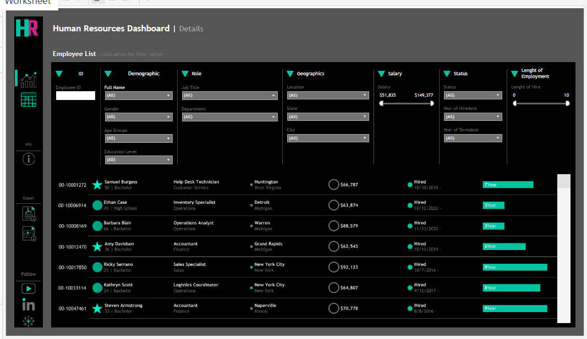
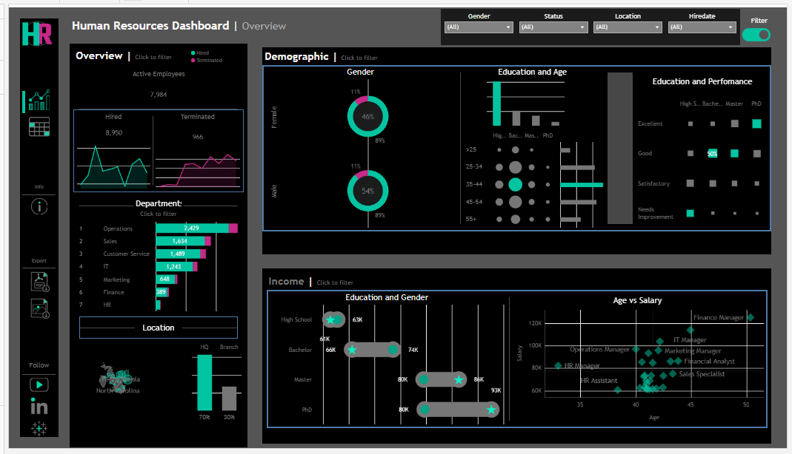

# HR-Dashboards

## Dashboards which contains employee's information 

### Table of Contents
---

- [Project Overview](#project-overview)
- [Data Sources](#data-sources)
- [Tools](#tools)
- [Aim](#aim)

## Project Overview
This project aims at showing all employee information which include their Names, Age, Educational Level, Salaries, Location, Department, Position and Gender all summarized in dashboards.

   
   

### Data Sources

This data sources is genarated using combination of ChatGPT prompts and the Python Faker library

### Tools

- Tableau Desktop - For creating visuals/ Dashboards

### Aim
 To combine all employee information in different charts into dashboards.

 ### Project Link

   [HR-Dashboards project](https://public.tableau.com/views/HRDashboards_17404294280790/HRSummary?:language=en-US&:sid=&:redirect=auth&:display_count=n&:origin=viz_share_link)
   

